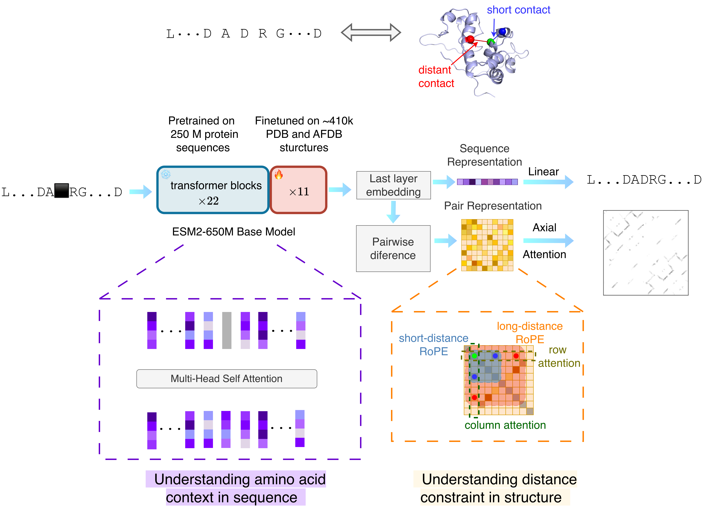
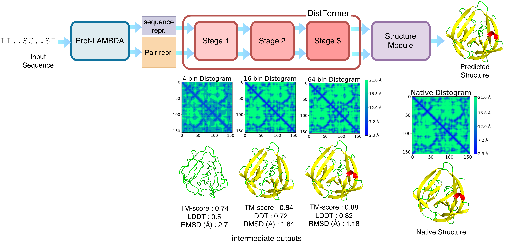

# Prot-LAMBDA

<a href="https://github.com/marktext/marktext/releases/latest">
   
   
   
   
   
</a>      <br>


***Prot-LAMBDA*** is a protein language model boosted with distance awareness for versatile structural understanding of proteins. Built upon this foundation, ***LAMBDAFold*** is a single-sequence 3D protein structure prediction pipeline. Additionally, ***LAMBDAFold-RAG*** introduces a Retrieval-Augmented Generation protocol that accepts AF2-style structural templates to further improve predicted structures.

<!-- Copyright (C) -------->

License: GPL v3. (If you are interested in a different license, for example, for commercial use, please contact us.) 

Contact: Daisuke Kihara (dkihara@purdue.edu)

For technical problems or questions, please reach to Nabil Ibtehaz (nibtehaz@purdue.edu).

## Citation:

>Ibtehaz, N., Zhang, Z., Kagaya, Y., Xu, M., Tomii, K., & Kihara, D. Prot-LAMBDA : Protein LAnguage Model Boosted with Distance Awareness improves structure understanding. (In submission)


## Online Platform (run easily and freely on Google Colab)

[https://bit.ly/domain-pfp-colab](https://bit.ly/domain-pfp-colab)

## Introduction
Protein language models (PLMs) learn evolutionary information from large-scale sequence data, but three-dimensional relationships are encoded only implicitly. Here, we introduce Prot-LAMBDA (Protein LAnguage Model Boosted with Distance Awareness), a PLM that explicitly incorporates spatial relationships by coupling residue embeddings with inter-residue contacts. Prot-LAMBDA improves performance across diverse structure-related tasks, including contact, secondary structure, backbone geometry, solvent accessibility, and protein fold prediction. Notably, it achieves a twofold improvement in long-range contact recall and an 11.7% reduction in ψ-angle prediction error relative to ESM2-3B. Despite having approximately fivefold fewer parameters, Prot-LAMBDA also improves 3D structure prediction over ESM2-3B by 5–7% in TM-score when coupled to the same structure-prediction module. Building on these representations, we developed LambdaFold, a lightweight distance-guided structure prediction framework that achieves performance comparable to ESMFold on proteins strictly non-redundant to the training data. Finally, retrieval-augmented integration of structural templates increases mean TM-score substantially for targets with high template coverage and rescues several incorrect folds. Together, these results demonstrate that explicit spatial constraints enable efficient and generalizable structural representation learning and protein structure prediction.  

## Overall Protocol

Prot-LAMBDA bridges protein sequence context with structural distance constraints. The core architecture is a language model partially finetuned from a pretrained ESM2-650M model. The embedding from the final transformer layer serves as the sequence representation, while its pairwise difference forms the pair representation, which are utilized for masked language modeling and contact map prediction, respectively. The lower panel highlights key architectural components: standard multi-head self-attention progressively refines the sequence representation, whereas a single layer of axial attention, integrated with RoPE to account for sequence separation, refines the pair representation. 



Sequence and pair representations from Prot-LAMBDA are processed by DistFormer, a compact distance-guided folding trunk with three stages of progressive refinement, generating distograms (4, 16, and 64 bins) and corresponding 3D structures. An example from CASP target T1034 illustrates increasing structural accuracy across stages, with improvements in TM-score, LDDT, and RMSD. The progressive development and refinement of secondary structures in successive stages can be observed. Structures are colored by secondary structure classes: red for alpha helices, yellow for beta sheets, and green for other regions.




## Pre-required software
Python 3.9 : https://www.python.org/downloads/    

## Installation  
### 1. [`Install git`](https://git-scm.com/book/en/v2/Getting-Started-Installing-Git) 
### 2. Clone the repository in your computer 
```
git clone https://github.com/kiharalab/Prot-LAMBDA && cd Prot-LAMBDA
```

### 3. Build dependencies.   
You have two options to install dependency on your computer:
#### 3.1 Install with pip and python.
##### 3.1.1[`install pip`](https://pip.pypa.io/en/stable/installing/).
##### 3.1.2  Install dependency in command line.
```
pip3 install -r requirements.txt --user
```

Installing the dependencies only require a few minutes on a standard desktop computer.

#### 3.2 Install with anaconda
##### 3.2.1 [`install conda`](). 
##### 3.2.2 Install dependency in command line
```
conda create -n protlambda python=3.9
conda activate protlambda
pip3 install -r requirements.txt 
```

Each time when you want to run this code, simply activate the environment by

```
conda activate protlambda
conda deactivate    (If you want to exit) 
```

## Prepare Data
Please download the model parameters from zenodo (10.5281/zenodo.21984993) and place them in the `params` directory.

## Source Codes

Our implementation of Prot-LAMBDA, LambdaFold and LambdaFold-RAG is provided in the `ProtLAMBDA` directory.


## Usage

We present some tutorials for using our model inside the `Example` directory.

Here we provide the following functionalities :  


### 1. Protein contact maps

Please run the notebook:
```
contact_map_prediction.ipynb
```

This usually takes <5 minutes to run.


<br>

### 2. Protein distogram

Please run the notebook:
```
distogram_prediction.ipynb
```

This usually takes <10 minutes to run.


<br>

### 3. Protein 3D structure

Please run the notebook:
```
protein_structure_prediction.ipynb
```

This usually takes <10 minutes to run.


### Input Files
Protein sequence in fasta format.
Our example input can be found in the `sample_protein` directory


## Acknowledgements

This project builds upon and integrates code and models developed by the following open-source projects:

* **[ESM (Evolutionary Scale Modeling)](https://github.com/facebookresearch/esm)**: Developed by Meta AI Research.
* **[OpenFold](https://github.com/aqlaboratory/openfold)**: A trainable, PyTorch reproduction of AlphaFold 2 developed by the AlQuraishi Lab.
  
We are grateful to the authors and contributors of these repositories for making their code and model weights publicly available to the research community.